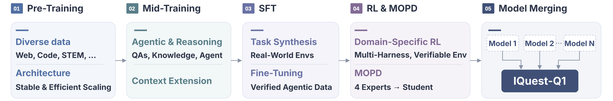
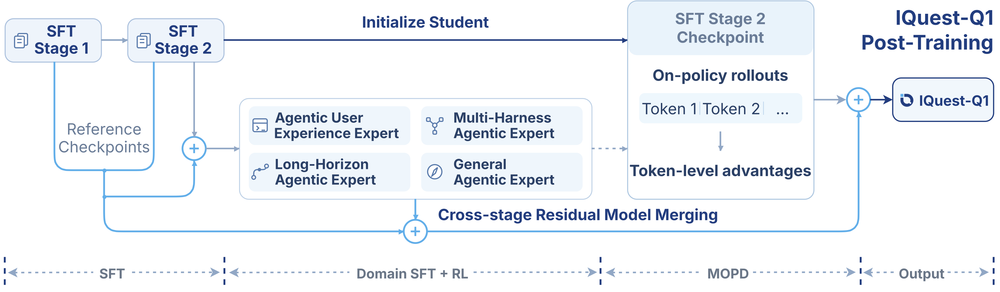
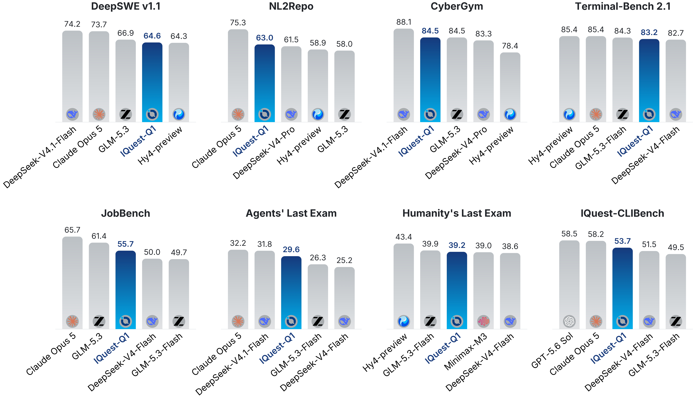

<h1 align="center">IQuest-Q1</h1>

<p align="center">Developed by <strong>IQuest</strong></p>

<p align="center">
  <a href="https://github.com/IQuestLab/IQuest-Q1"></a>
  <a href="https://huggingface.co/IQuestLab/IQuest-Q1"></a>
</p>

<p align="center">
  <a href="#model-introduction">Introduction</a> ·
  <a href="#performance">Performance</a> ·
  <a href="#quick-start">Quick Start</a> ·
  <a href="#deployment">Deployment</a> ·
  <a href="#limitations">Limitations</a> ·
  <a href="#contact-us">Contact Us</a>
</p>

---

## Introduction

**IQuest-Q1** is a Mixture-of-Experts (MoE) model developed by **IQuest** for agentic coding, reasoning, and multi-step tool use. It comprises approximately **320B total parameters**, with an estimated **15B parameters activated per token**.


<p align="center">
  
  <br>
  <em>Training pipeline of IQuest-Q1.</em>
</p>

<p align="center">
  
  <br>
  <em>IQuest-Q1 Post-Training Pipeline.</em>
</p>

### Model Specifications

| Property | IQuest-Q1 |
| :--- | :--- |
| Total Parameters | 320B |
| Activated Parameters | 15B |
| Transformer layers | 88 |
| Hidden dimension | 3,072 |
| Attention Heads (Q/KV) | 48/8 |
| Head Dimension | 128 |
| Hybrid Attention Pattern | 3 SWA + 1 FA |
| Sliding Window Size | 4,096 |
| Partial RoPE Dimensions | 32 |
| Experts (Total/Activated) | 256/8 |
| MTP Layers | 2 Independent (Training) / 1 Recursive x8 (Inference) |
| MTP Sliding Window Size | 512 (Inference) |
| Context length | 524,288 |

## Performance


<p align="center">
  
  <br>
  <em>IQuest-Q1 performance across benchmarks. DeepSeek-V4-Flash/Pro refer to the official 0731/0813 releases, respectively. Humanity's Last Exam is reported without tools. IQuest-CLIBench is our in-house benchmark for CLI user experience.</em>
</p>

### Benchmark Notes

For reproducibility, we recommend using a temperature of 1.0, top-p of 0.95, and top-k of 20, with Claude Code `2.1.140` or Codex `0.142` as the respective harness.

For each model, we report the publicly reported score; otherwise, we evaluate the model using the corresponding benchmark setup:
(1) Harness: For agentic coding tasks, we use mini-SWE-agent for DeepSWE v1.1, and Claude Code for other tasks. For Agents' Last Exam, we evaluate our model using Claude Code `2.1.258`. Because our models currently do not have multimodal capability, we replace multimodal content inputs in the agent conversation with placeholders during tokenization. (2) Runtime: We set six-hour limits for CyberGym, eight hours for Terminal-Bench 2.1.


## Quick Start

Start a server as described in [Deployment](#deployment), install the client with `pip install openai`, and then call the OpenAI-compatible API:

```python
from openai import OpenAI

client = OpenAI(base_url="http://127.0.0.1:8000/v1", api_key="sk-iquest")
response = client.chat.completions.create(
    model="IQuest-Q1",
    messages=[
        {"role": "user", "content": "Hello! Can you briefly introduce yourself?"},
    ],
    temperature=1.0,
    top_p=0.95,
)
print(response.choices[0].message.content)
```

## Deployment

For production deployment, we recommend using [SGLang](https://github.com/sgl-project/sglang/pull/41590) or [vLLM](https://github.com/IQuestLab/vllm-iquest-q1). 

### SGLang

Use our prebuilt image [iquestlabworkspace/sglang-iquest-q1:cu130](https://hub.docker.com/repository/docker/iquestlabworkspace/sglang-iquest-q1/tags/cu130/):

```bash
docker pull iquestlabworkspace/sglang-iquest-q1:cu130

# without MTP
MODEL_ROOT="$(hf download IQuestLab/IQuest-Q1 --quiet)" && \
python -u -m sglang.launch_server \
  --model-path "$MODEL_ROOT" \
  --served-model-name IQuest-Q1 \
  --tp-size 8 \
  --dtype bfloat16 \
  --attention-backend fa3 \
  --mem-fraction-static 0.85 \
  --disable-prefill-cuda-graph \
  --enable-metrics \
  --tool-call-parser iquest_q1 \
  --reasoning-parser iquest_q1 \
  --enable-torch-compile \
  --load-format fastsafetensors \
  --speculative-use-rejection-sampling

# with recursive MTP
MODEL_ROOT="$(hf download IQuestLab/IQuest-Q1 --quiet)" && \
python -u -m sglang.launch_server \
    --model-path "$MODEL_ROOT" \
    --served-model-name IQuest-Q1 \
    --tp-size 8 \
    --dtype bfloat16 \
    --attention-backend fa3 \
    --mem-fraction-static 0.85 \
    --disable-prefill-cuda-graph \
    --enable-metrics \
    --tool-call-parser iquest_q1 \
    --reasoning-parser iquest_q1 \
    --speculative-algorithm EAGLE \
    --speculative-num-steps 5 \
    --speculative-eagle-topk 1 \
    --speculative-num-draft-tokens 6 \
    --speculative-draft-model-path "$MODEL_ROOT/mtp" \
    --enable-torch-compile \
    --load-format fastsafetensors \
    --speculative-use-rejection-sampling \
    --speculative-draft-attention-backend fa3
```

### vLLM

Use our image [iquestlabworkspace/vllm-iquest-q1:cu130](https://hub.docker.com/repository/docker/iquestlabworkspace/vllm-iquest-q1/tags/cu130):

```bash
docker pull iquestlabworkspace/vllm-iquest-q1:cu130

# without MTP
MODEL_ROOT="$(hf download IQuestLab/IQuest-Q1 --quiet)" && \
vllm serve "$MODEL_ROOT" \
  --served-model-name IQuest-Q1 \
  --tensor-parallel-size 8 \
  --reasoning-parser iquest_q1 \
  --enable-auto-tool-choice \
  --tool-call-parser iquest_q1

# with recursive MTP
MODEL_ROOT="$(hf download IQuestLab/IQuest-Q1 --quiet)" && \
vllm serve "$MODEL_ROOT" \
  --served-model-name IQuest-Q1 \
  --tensor-parallel-size 8 \
  --reasoning-parser iquest_q1 \
  --enable-auto-tool-choice \
  --tool-call-parser iquest_q1 \
  --enable-prefix-caching \
  --speculative-config '{
    "method": "eagle",
    "model": "'"$MODEL_ROOT"'/mtp",
    "num_speculative_tokens": 5,
    "draft_sample_method": "probabilistic",
    "rejection_sample_method": "standard",
    "enforce_eager": false
  }'
```

### Tool Use and Agent Integration

Use a gateway that supports tool calling via **Anthropic Messages** for `Claude Code` and **OpenAI Responses** for `Codex`.

#### Claude Code

We recommend version `2.1.140` and the IQuest-Q1[1m] client-side setting does not change 512K context limit.

```bash
export ANTHROPIC_MODEL="IQuest-Q1[1m]"
export ANTHROPIC_DEFAULT_SONNET_MODEL="IQuest-Q1[1m]"
export ANTHROPIC_DEFAULT_OPUS_MODEL="IQuest-Q1[1m]"
export ANTHROPIC_DEFAULT_HAIKU_MODEL="IQuest-Q1[1m]"
export CLAUDE_CODE_SUBAGENT_MODEL="IQuest-Q1[1m]"
export CLAUDE_CODE_MAX_OUTPUT_TOKENS="131072"
export CLAUDE_AUTOCOMPACT_PCT_OVERRIDE="80"
export CLAUDE_CODE_AUTO_COMPACT_WINDOW="524288"
export API_TIMEOUT_MS="3000000"
export CLAUDE_CODE_DISABLE_NONESSENTIAL_TRAFFIC="1"
export CLAUDE_CODE_DISABLE_EXPERIMENTAL_BETAS="1"
export ANTHROPIC_BASE_URL="http://example-iquest-q1-link"
export ANTHROPIC_AUTH_TOKEN="sk-iquest-q1"
claude --model IQuest-Q1
```

#### Codex CLI

We recommend version `0.142.0`.

```
export OPENAI_API_KEY="sk-iquest-q1"
export MODEL_ID="IQuest-Q1"
# Add /v1 if required by your gateway's Responses endpoint.
export BASE_URL="http://example-iquest-q1-link"

(
  set -eu
  CONFIG_DIR="${HOME}/.codex"
  mkdir -p -- "$CONFIG_DIR"
  CONFIG_DIR="$(cd -- "$CONFIG_DIR" && pwd -P)"
  # Back up existing files before replacing them.
  BACKUP_SUFFIX="$(date +%Y%m%d-%H%M%S)-$$"
  for FILE in config.toml model_catalog.json; do
    if [ -f "$CONFIG_DIR/$FILE" ]; then
      cp -p -- "$CONFIG_DIR/$FILE" "$CONFIG_DIR/$FILE.bak.$BACKUP_SUFFIX"
    fi
  done
  # This configuration disables approval prompts and sandboxing.
  cat > "$CONFIG_DIR/config.toml" <<EOF
model = "$MODEL_ID"
model_provider = "iquest"
approval_policy = "never"
sandbox_mode = "danger-full-access"
web_search = "disabled"
model_reasoning_summary = "detailed"
model_supports_reasoning_summaries = true
model_context_window = 524288
model_auto_compact_token_limit = 419430
model_auto_compact_token_limit_scope = "total"
tool_output_token_limit = 32768
model_catalog_json = "$CONFIG_DIR/model_catalog.json"
[model_providers.iquest]
name = "iquest"
base_url = "${BASE_URL%/}"
wire_api = "responses"
env_key = "OPENAI_API_KEY"
supports_websockets = false
request_max_retries = 20
stream_max_retries = 20
stream_idle_timeout_ms = 600000
[model_providers.iquest.http_headers]
max-output-tokens = "131072"
EOF
  # The gateway must support the reasoning options and max-output-tokens header.
  cat > "$CONFIG_DIR/model_catalog.json" <<EOF
{
  "models": [
    {
      "slug": "$MODEL_ID",
      "display_name": "$MODEL_ID",
      "description": "IQuest-Q1 served through an API gateway.",
      "context_window": 524288,
      "input_modalities": ["text"],
      "base_instructions": "",
      "supported_reasoning_levels": [],
      "supports_reasoning_summaries": true,
      "supports_parallel_tool_calls": false,
      "shell_type": "default",
      "tool_mode": "default",
      "truncation_policy": {
        "mode": "tokens",
        "limit": 10000
      },
      "visibility": "list",
      "supported_in_api": true,
      "priority": 1,
      "support_verbosity": false,
      "experimental_supported_tools": []
    }
  ]
}
EOF
  codex --model "$MODEL_ID"
)
```

## Limitations

- **Text-only input.** This checkpoint has no native image, audio, or video input capability.
- **Output reliability.** Generated explanations and code can be incorrect. Review code changes and verify them with task-appropriate tests.
- **Tool integration.** Tool calls use the IQuest-specific format in the chat template. Structured tool execution and reasoning extraction require compatible serving parsers and an agent harness.
- **Challenges in Real-World CLI Tasks.** Real-world CLI tasks often require iterative debugging and verification. IQuest-Q1 may overlook constraints, repeat failed attempts, or leave issues unresolved, necessitating human oversight.
- **Ongoing development.** IQuest-Q1 remains at an early stage, with substantial limitations in its capabilities and reliability. Much work remains, and we still have a long way to go.


## Contact Us

For technical questions, feedback, or collaboration inquiries, please email us at [research@iquestlab.com](mailto:research@iquestlab.com).

---

<p align="center"><strong>IQuest</strong></p>
